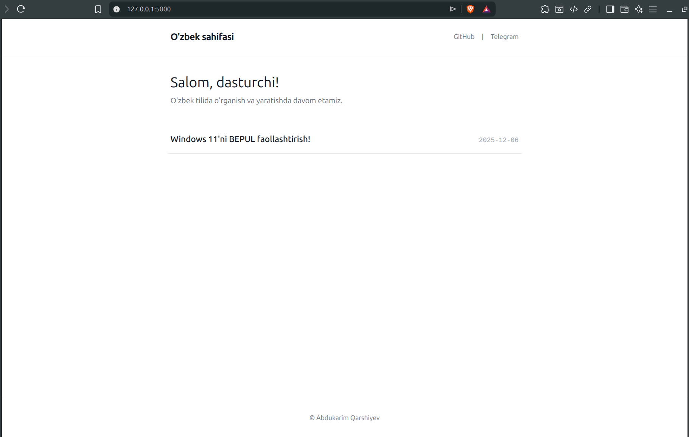

# Flask Minimalist Blog Template



Ushbu loyiha Python va Flask yordamida yaratilgan minimalist, ochiq kodli shaxsiy blog template'idir. U Markdown fayllari asosida ishlaydi, admin paneli (login) va sintaksisni yoritish (syntax highlighting) funksiyasiga ega.

## Xususiyatlari

* Texnologiyalar: Python 3, Flask, Jinja2, Tailwind CSS (CDN orqali).
* Postlar: `posts/` papkasida Markdown (.md) fayllarida saqlanadi.
* Admin Panel: Postlarni yaratish, tahrirlash (Edit) va o'chirish (Delete).
* Dizayn: Minimalistik, tezkor va mobil qurilmalarga mos.
* Kod: Kod bloklarini rangli qilish va nusxalash tugmasi (Highlight.js, Pygments).
* Rasm boshqaruvi: Bir nechta rasmlarni yuklash va ularning Markdown URL'larini nusxalash imkoniyati.

---

## O'rnatish

### 1. Loyihani yuklash

Loyihani o'zingizning kompyuteringizga klonlab oling:

```bash
git clone https://github.com/akarshiev/Flask-Markdown-Blog-Template.git
cd Flask-Markdown-Blog-Template
```

### 2. Virtual muhit yaratish va kutubxonalarni o'rnatish
Barcha kerakli kutubxonalarni o'rnatish uchun:

```bash
python -m venv .venv
source .venv/bin/activate  # Linux/Mac/Git Bash
# .venv\Scripts\activate   # Windows CMD

pip install -r requirements.txt
```

### 3. Konfiguratsiyani sozlash
config.py faylida loyiha xavfsizligini ta'minlash uchun qiymatlarni o'zgartiring:
- `SECRET_KEY`: Maxfiy kalitni o'zingizning noyob matningizga o'zgartiring.
- `ADMIN_HASH`: Admin paroli hashini o'zgartiring. Parol yaratish uchun Python terminalida quyidagi buyruqdan foydalanishingiz mumkin:
```python
import hashlib
hashlib.sha256("SIZNING_YANGI_PAROLINGIZ".encode()).hexdigest()
```

### 4. Ishga tushirish
```Bash
python run.py
```

## Admin Kirish
URL: `/admin/login`

Default Parol: `admin123` (Agarda `config.py` dagi `ADMIN_HASH` qiymatini o'zgartirmagan bo'lsangiz.)

## Vercel'da Deploy qilish
Loyihani serverless platformada (Vercel) ishga tushirish uchun barcha kerakli konfiguratsiya ( `wsgi.py` va `vercel.json`) fayllari mavjud.
GitHub'da .gitkeep fayli yordamida posts/ papkasi yuklanganligiga ishonch hosil qiling.
Vercel Environment Variables'da SECRET_KEY va ADMIN_HASH qiymatlarini kiritishni unutmang.

## Hissa Qo'shish (Contributing)
Agar siz loyihaga hissa qo'shmoqchi bo'lsangiz, barcha turdagi pull request'lar va xato xabarlarini (bug reports) mamnuniyat bilan qabul qilaman.

> O'rganishda davom etamiz!